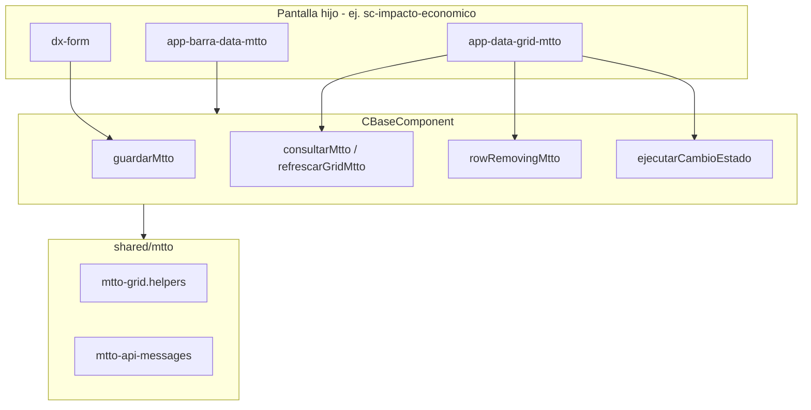
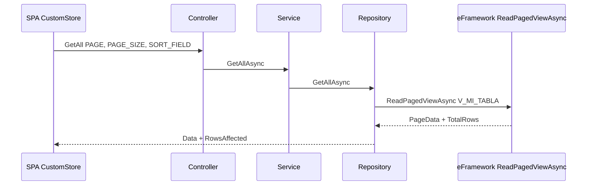

# Guía para el equipo — Mantenimientos SGUEES v1.1

**Audiencia:** programadores que crean o migran pantallas de catálogo.  
**Versión:** 1.1 — julio 2026  
**PDF resumido (reunión / correo):** [GUIA-EQUIPO-MTTO-RESUMEN.pdf](./GUIA-EQUIPO-MTTO-RESUMEN.pdf)  
**Documento maestro:** [ESTANDAR-MTTO.md](./ESTANDAR-MTTO.md)

---

## 1. Objetivo

Unificar cómo hacemos mantenimientos (mtto) en SGUEES para que:

- Todas las pantallas se vean y se comporten igual (barra, grid, formulario, permisos).
- El código del hijo sea **delgado** — la lógica común vive en `CBaseComponent` y `shared/mtto/`.
- La IA (Cursor) y cualquier desarrollador produzcan el mismo resultado copiando **plantillas**, no pantallas piloto al azar.
- Los PR se revisen con el mismo checklist.

**Piloto cerrado y validado:** `sc-impacto-economico` (A+P + estado catálogo).  
**Referencia A+ estable:** `gen-banco`.

---

## 2. Mapa de documentos (qué leer y cuándo)

| Orden | Documento | Para qué |
|-------|-----------|----------|
| 1 | **Este archivo** | Onboarding y explicación al equipo |
| 2 | [ESTANDAR-MTTO.md](./ESTANDAR-MTTO.md) | Reglas completas (permisos, menú, UTF-8, tipos) |
| 3 | [plantillas/README.md](./plantillas/README.md) | Índice de plantillas congeladas |
| 4 | Plantilla según tipo | Código esqueleto copy-paste |
| 5 | [CHECKLIST-PR-MTTO.md](./CHECKLIST-PR-MTTO.md) | Antes de abrir PR |
| 6 | [PROMPT-MTTO.md](./PROMPT-MTTO.md) | Texto para pedir pantallas a Cursor |
| 7 | [ESTANDAR-EFRAMEWORK-PAGING.md](./ESTANDAR-EFRAMEWORK-PAGING.md) | Solo si el catálogo es A+P (paginado servidor) |

### Plantillas por tipo

| Situación | Plantilla |
|-----------|-----------|
| Catálogo pequeño (&lt; ~500 filas) | [mtto-a-plus.md](./plantillas/mtto-a-plus.md) |
| Catálogo + activo/inactivo | A+ o A+P + [mtto-a-plus-estado-catalogo.md](./plantillas/mtto-a-plus-estado-catalogo.md) |
| Catálogo grande / auditoría en grid | [mtto-a-p-paginado.md](./plantillas/mtto-a-p-paginado.md) |
| Documento con estados DI/AP/AN | [mtto-estado-transaccional.md](./plantillas/mtto-estado-transaccional.md) |

---

## 3. Guion para explicar en reunión (15 minutos)

### Slide mental 1 — Problema

Antes cada pantalla tenía su propio grid, su propio guardar, su propio `consultar()` después de guardar, permisos mezclados entre catálogos, y catálogos grandes que cargaban miles de filas al navegador.

### Slide mental 2 — Solución

Tres capas:

1. **Plantillas en `DOCS/plantillas/`** — fuente de verdad, no copiar ciego el piloto.
2. **Padre SPA `CBaseComponent`** — `guardarMtto`, `consultarMtto`, `rowRemovingMtto`, parche del grid sin segunda petición.
3. **Grid padre `app-data-grid-mtto`** — toolbar unificada, pager estándar, Activar/Desactivar v1.1.

### Slide mental 3 — Elegir tipo

```
¿Una sola tabla/vista?
  ├─ ¿Muchas filas o columnas de auditoría? → A+P (CustomStore + SQL paginado)
  └─ ¿Pocas filas? → A+ (un getAll → array en memoria)

¿Encabezado + tabla *_DETA? → Tipo C (con-partida, com-documento)

¿Solo activo/inactivo (bit)? → + plantilla estado catálogo
¿Estados de negocio (DI, AP, AN)? → estado transaccional — NO usar Activar/Desactivar genérico
```

### Slide mental 4 — Piloto

- **gen-banco** → copiar patrón A+.
- **sc-impacto-economico** → copiar patrón A+P + estado catálogo + API paginada.

### Slide mental 5 — Reglas que no se negocian

1. HTML: `app-barra-data-mtto` + `dx-form` + `app-data-grid-mtto` dentro de `.sguees-mtto-view`.
2. `mttoGridKeyExpr` obligatorio en catálogos.
3. **No** `onSuccess: () => consultar()` después de guardar — el padre parchea el grid.
4. Permisos: quien **consume** los datos define el `[Authorize]` — ver sección 8.
5. PR con [CHECKLIST-PR-MTTO.md](./CHECKLIST-PR-MTTO.md).

---

## 4. Tipos de mantenimiento

| Tipo | Carga de datos | Paginación | Cuándo |
|------|----------------|------------|--------|
| **A+** | 1× `getAll` → `models[]` | Cliente (DevExtreme) | &lt; ~500 filas por empresa |
| **A+P** | `CustomStore` por página | Servidor (`PAGE`, `PAGE_SIZE`) | Catálogos grandes, auditoría |
| **B** | Igual que A/A+ | — | Form con combos `getLookUp` |
| **C** | Encabezado + detalle | — | Partidas, documentos |

### Defaults del padre (`CBaseComponent`)

| Propiedad | Valor default | Notas |
|-----------|---------------|-------|
| `mttoPageSize` | 20 | Override en hijo si hace falta |
| `mttoPageSizes` | 20, 50, 100, 200, all | Pager del grid |
| `mttoRemoteOperations` | `false` | A+; A+P usa objeto con `paging: true` |
| `mttoParchearGridTrasGuardar` | `true` | Evita reload completo |

---

## 5. Arquitectura SPA (lo que hace cada capa)



### Flags típicos en el hijo (A+)

```typescript
protected override etiquetaRegistro = 'el banco';
protected override requiereEmpresaSesion = true;
protected override mttoGridKeyExpr = 'CORR_BANCO';
```

### Flags típicos en el hijo (A+P)

```typescript
protected override mttoRemoteOperations = { paging: true, sorting: true, filtering: false };
protected override mttoGridKeyExpr = 'CORR_XXX';

@ViewChild(DataGridMttoComponent, { static: false }) dataGrid!: DataGridMttoComponent;
protected override getMttoDataGrid() { return this.dataGrid ?? null; }
```

**Importante:** `filtering: false` significa que la **fila de filtro del grid filtra solo la página cargada**, no envía filtros al API. Es intencional en v1.1.

---

## 6. Arquitectura API A+P (paginado servidor)



### Contrato GetAll (único para A+P)

| Parámetro | Descripción |
|-----------|-------------|
| `CORR_EMPRESA` | Desde token JWT |
| `PAGE` | 1-based |
| `PAGE_SIZE` | Tamaño; `0` = todos (opción «all») |
| `SORT_FIELD` | Columna en whitelist del repository |
| `SORT_DESC` | `true` / `false` |

**Respuesta:** `Data` = filas de la página, `RowsAffected` = total para el pager.

**Prohibido en A+P v1.1:** SQL crudo por repository, `Skip`/`Take` en C# tras cargar todo, filtros JSON remotos (`FILTER_ROW_JSON`).

Detalle técnico: [ESTANDAR-EFRAMEWORK-PAGING.md](./ESTANDAR-EFRAMEWORK-PAGING.md).

### Capas API — responsabilidades (piloto impacto)

| Capa | Responsabilidad |
|------|-----------------|
| **Controller** | `[Authorize]`, auditoría (`SetCreateAudit` / `SetUpdateAudit`), `ApplyPrimaryKeyFromQuery` en PUT, claims (`CORR_EMPRESA`) |
| **Service** | Validaciones de negocio, `ValidateEmpresaSesion`, duplicados (`ExistsDescripcionAsync` con `excludeCorr` en update) |
| **Repository** | `ReadPagedViewAsync`, whitelist `_AllowedSortFields`, SQL de negocio mínimo |

### SPA service — update con PK

DevExtreme puede enviar la PK en query y `0` en el body. El service debe forzar la PK:

```typescript
update(model: any): Observable<IResult> {
  const corr = Number(model?.CORR_IMPACTO_ECONOMICO ?? 0);
  const payload = { ...model, CORR_IMPACTO_ECONOMICO: corr };
  return this.repo.update(payload, [{ Parameter: 'CORR_IMPACTO_ECONOMICO', Value: corr }]);
}
```

---

## 7. Estado catálogo v1.1 (activo / inactivo)

Para catálogos con campo `bit` (ej. `ESTADO_IMPACTO_ECONOMICO`):

| Capa | Qué hacer |
|------|-----------|
| BD | Campo `bit`, default activo, en vista `V_*` |
| Grid | Badge verde/rojo con `createEstadoColumnConfig` — **sin** botones por fila |
| Toolbar | `[showEstadoToolbar]="true"` + Activar/Desactivar sobre fila seleccionada |
| API | `Put Activar` / `Put Desactivar` con permiso `\|U` |

Plantilla completa: [mtto-a-plus-estado-catalogo.md](./plantillas/mtto-a-plus-estado-catalogo.md).

**Deprecado:** `buildEstadoActionButtons` (botones Activar/Desactivar en cada fila).

---

## 8. Permisos — regla de oro

> **¿Quién consume los datos?** → ese permiso va en `[Authorize]`.  
> **¿De dónde se leen?** → ese controlador ejecuta la consulta.

Ejemplo: la pantalla de partidas necesita cuentas contables, pero el usuario no tiene permiso de «Catálogo de Cuentas».

- Crear en `CON_CATALOGO_CUENTAController`: `GetCUENTA_CONTABLE_CON_PARTIDA`
- Policy: `/con-partida|R` (consumidor), **no** `/con-catalogo-cuenta|R`

| Caso | Policy |
|------|--------|
| CRUD de mi tabla | `/mi-ruta-spa\|R/C/U/D` |
| Detalle `*_DETA` | Permiso del **padre** |
| Combo `getLookUp` | `/url-consumidor\|R` en endpoint del catálogo origen |
| Grilla llena con datos ajenos | `objData.Get` en **repository** — no `getLookUp` |

Tras cambiar permisos en BD: el usuario debe **cerrar sesión y volver a entrar**.

---

## 9. Paso a paso — pantalla nueva

### Entrada mínima del analista / líder

| Dato | Ejemplo |
|------|---------|
| Tabla(s) | `SC_IMPACTO_ECONOMICO` |
| Vista | `V_SC_IMPACTO_ECONOMICO` |
| Módulo SPA | `SelectionHiring` |
| Ruta / JWT | `/sc-impacto-economico` |
| Menú | Sistema, menú, orden, nombre visible |
| ¿Activo/inactivo? | Sí → bit + plantilla estado |

### Entregables del programador

1. **BD** — Vista, SP si aplica, script menú (`SEG_OPCION_SISTEMA`, `SEG_CONFIG_OPCION`, permisos). `sqlcmd -f 65001`.
2. **API** — Models, Repository, Service, Controller.
3. **SPA** — Carpeta pantalla, routing en módulo padre, `exports: [RouterModule]`.
4. **PR** — Checklist marcado + compilación SPA y API.

### Orden de trabajo recomendado

1. Leer plantilla correcta en `DOCS/plantillas/`.
2. Comparar con piloto (`gen-banco` o `sc-impacto-economico`) solo para dudas.
3. API primero (GetAll con contrato correcto).
4. SPA hijo delgado extendiendo `CBaseComponent`.
5. Menú y permisos de prueba.
6. Checklist PR.

---

## 10. HTML estándar (obligatorio)

```html
<div class="sguees-mtto-view">
  <app-barra-data-mtto ... />
  <dx-form *ngIf="!isBrowse()" ... />
  <app-data-grid-mtto
    [isBrowse]="isBrowse()"
    [models]="models"
    [columns]="columns"
    [keyExpr]="mttoGridKeyExpr"
    [remoteOperations]="mttoRemoteOperations"
    [pageSize]="mttoPageSize"
    [allowedPageSizes]="mttoPageSizes"
    (editClick)="editarClick($event)"
    (rowRemoving)="rowRemoving($event)"
    ...
  />
</div>
```

| Hacer | No hacer |
|-------|----------|
| `app-data-grid-mtto` | `dx-data-grid` suelto en listado principal |
| `(editClick)="editarClick($event)"` | Botón edit custom en columnas |
| Sin `columnAutoWidth` en grid principal | `[columnAutoWidth]="true"` |
| Sin `.scss` por pantalla (salvo excepción) | Estilos locales duplicando el shell |

---

## 11. Qué NO está en el estándar v1.1

Estas funciones se evaluaron y **no** forman parte del estándar actual:

| Función | Motivo |
|---------|--------|
| Panel de agrupación en `app-data-grid-mtto` | Toolbar unificada custom (DevExtreme 24) no lo integra bien; rompe layout |
| Filtros remotos al API desde filter row | Complejidad; A+P usa `filtering: false` |
| Agrupamiento servidor | Fuera de alcance v1.1 |

Para agrupar datos masivos, usar reportes o pantallas de consulta dedicadas.

---

## 12. Anti-patrones (evitar)

| Anti-patrón | Correcto |
|-------------|----------|
| `consultar()` después de cada guardar | `guardarMtto` — parche local |
| Copiar 1.100 líneas del repo legacy impacto | `ReadPagedViewAsync` (~300 líneas) |
| `ExistsDescripcion` sin excluir PK en update | `excludeCorr` con PK del registro |
| PK `0` en body del PUT | `ApplyPrimaryKeyFromQuery` + service SPA con PK explícita |
| `getLookUp` para llenar grillas completas | `objData.Get` en repository |
| Permiso del catálogo origen en cross-tabla | Permiso del consumidor |
| `p-toast` local / `override notifyFx` | Shell global |
| Pantallas nuevas en Selection sin estándar | Migrar al tocar; **nada nuevo fuera de estándar** |

---

## 13. Usar Cursor / IA

Frase disparadora (ver [PROMPT-MTTO.md](./PROMPT-MTTO.md)):

> Tengo la tabla `___`, la vista `V___`, módulo `___`, ruta `/___`. Crear mantenimiento según estándar SGUEES.

La IA debe leer `DOCS/plantillas/` y **no** inventar estructura. Regla Cursor: `.cursor/rules/sguees-mtto-estandar.mdc`.

---

## 14. Referencias de código (piloto)

| Necesidad | Ruta |
|-----------|------|
| A+ SPA | `SGUEES-SPA/src/app/pages/General/gen-banco/` |
| A+P SPA | `SGUEES-SPA/src/app/pages/SelectionHiring/sc-impacto-economico/` |
| Padre SPA | `SGUEES-SPA/src/app/FxAPI/CBaseComponent.component.ts` |
| Grid padre | `SGUEES-SPA/src/app/layouts/data-grid-mtto/` |
| Helpers | `SGUEES-SPA/src/app/shared/mtto/` |
| API A+P | `SGUEES-API/sguees.api/Options/SelectionHiring/SC_IMPACTO_ECONOMICO/` |
| Paging framework | `eFramework` → `ReadPagedViewAsync` |

---

## 15. Preguntas frecuentes

**¿Puedo usar A+ si el catálogo tiene 300 filas hoy pero crecerá?**  
Si el crecimiento es real, implementa A+P desde el inicio. Migrar después cuesta más.

**¿El filter row en A+P filtra toda la BD?**  
No. Solo la página actual en el navegador. Para búsqueda global hace falta otro diseño (no v1.1).

**¿Dónde van Activar y Desactivar?**  
En la toolbar del grid (`showEstadoToolbar`), no en cada fila.

**¿El detalle tiene su propio menú?**  
No. Mismos permisos del padre en API; sin componente SPA propio.

**¿Qué hago con pantallas legacy de Selection?**  
Al modificarlas, migrar a plantilla. Pantallas nuevas: solo estándar v1.1.

---

## 16. Checklist express (antes de PR)

- [ ] Plantilla correcta aplicada
- [ ] `CBaseComponent` + 4 regiones TS
- [ ] `mttoGridKeyExpr` definido
- [ ] Sin `consultar()` post-guardar
- [ ] Permisos API alineados con JWT
- [ ] Menú BD si pantalla nueva
- [ ] UTF-8 / tildes en textos y SQL
- [ ] [CHECKLIST-PR-MTTO.md](./CHECKLIST-PR-MTTO.md) completo

---

*STI / UEES — julio 2026 — Paquete estándar mtto v1.1*
